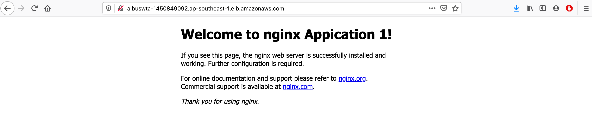

# Talent Assignment Test - DevOps Engineer

## A. Question

### 1. What is your idea of DevOps? Describe the daily operations of a DevOps Engineer

- DevOps is a set of practices that automates the processes between software development and IT teams, in order that they can build, test, and release software faster and more reliably. The concept of DevOps is founded on building a culture of collaboration between teams that historically functioned in relative siloes. The promised benefits include increased trust, faster software releases, ability to solve critical issues quickly, and better manage unplanned work.
- Daily operations of a DevOps Engineer:

    + Work directly with the DevOps team and Senior DevOps manager to test system integrity
    + Design and implement build, deployment, and configuration management
    + Test implemented designs
    + Build and test automation tools for infrastructure provisioning
    + Handle code deployments in all environments
    + Monitor metrics and develop ways to improve
    + Provide technical guidance and educate team members and coworkers on development and operations
    + Brainstorm for new ideas and ways to improve development delivery
    + Consult with peers for feedback during testing stages
    + Build, maintain, and monitor configuration standards
    + Maintain day-to-day management and administration of projects
    + Manage CI and CD tools with team
    + Document and design various processes; update existing processes
    + Improve infrastructure development and application development
    + Follow all best practices and procedures as established by the company

### 2. Why did you apply for the DevOps Engineer position?

I have experience about this field and I want to use it to make company's bussiness achieves a new success

## B. Assignment

### 1. Diagram


We will create a VPC, 2 public subnet, 2 private subnet, 1 Internet Gateway, 1 ALB, 1 NAT Gateway.

In Private Subnets, we create 2 Nginx Apps.
In Public Subnet, we create a Bastion Host to access machines in Private Subnets

### 2. Pre Install
- Install `awscli`, `terraform cli` on local machine
- Have a AWS account and have credential at `~./aws/credentials` with format:
```
[default]
aws_access_key_id = XXX
aws_secret_access_key = XXX
```
- Create a key pair to access EC2 instances on AWS (e.g `devops`)

### 3. Install

Run these commands to create infrastructure:

```
terraform init
terraform plan
terraform apply
```

When terraform create completed, it will show info was defined at file `output.tf`

#### 4. Result

My result at link: http://albuswta-1450849092.ap-southeast-1.elb.amazonaws.com/

You can see it will be load balanced by 2 web server 


